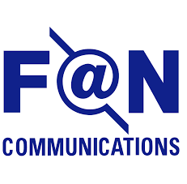
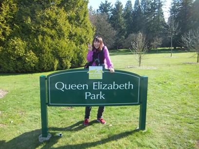
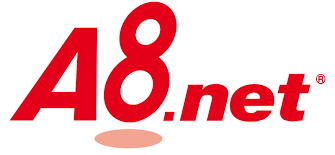
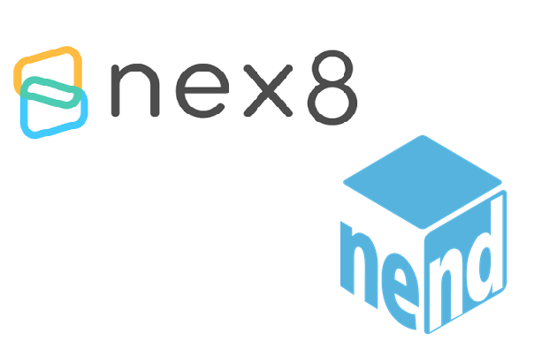

---

## 自己紹介

### 内田 あさこ (Asako Uchida)

- 新卒からインフラエンジニア
- バンクーバー留学
- インフラエンジニアとして、F@Nに入社
- エンジニア採用など

---

## 会社概要

- 会社名　　株式会社ファンコミュニケーションズ
- 設立年　　1999年10月1日
- 本社　　　東京渋谷区渋谷1-1-8
- 従業員数　単体413名
- 資本金　　11億6,894万円

---

## 事業概要

- インターネット広告サービスをグローバルに展開

--

## アフェリエイト

--

## アドネットワーク

--

- 月間400億のインプレッション
- <!-- .element: class="fragment" --> 秒間数十万のリクエスト
- <!-- .element: class="fragment" --> 1000台以上のWebサーバー

--

会社を利用し自己成長できる環境

---

### インターン その１
## データ分析インターン

- 内容：サービスから生み出されたビッグデータの解析
- 言語：Python

※ 初心者の方でも安心！入門テキストあり！

--

### インターン その２
## Scalaインターン

- 内容：サービスで使用されているScalaに触れる
- 言語：Scala

--

### インターン その３
## SDKインターン

- 内容：SDKの基礎を学習。アプリに広告を組み込む。
- 言語：Swift、Java、Kotlin

---

## ご清聴ありがとうございました。

https://fan-as-uchida.github.io/event2018/
