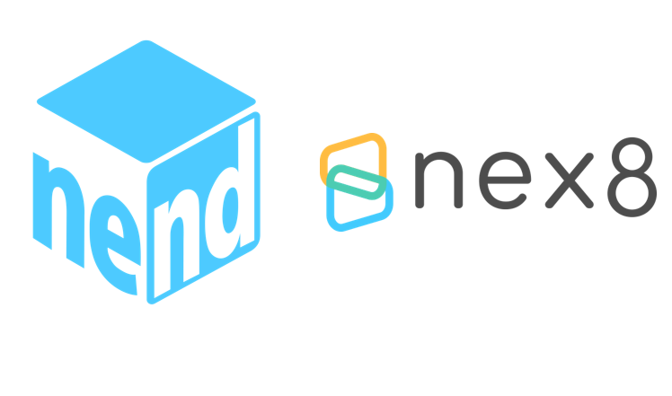
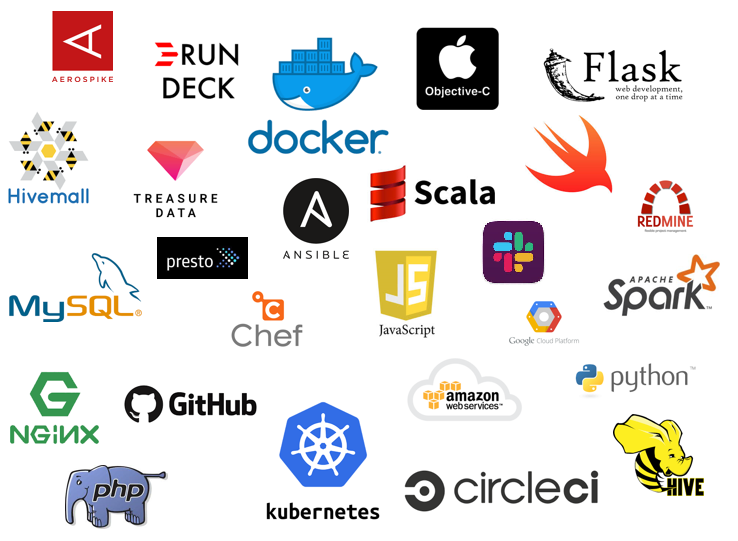

---

- 会社名：株式会社ファンコミュニケーションズ

- 従業員数：411名

--

# アドネットワーク企業

--

--

--

---

# nend

- 広告主とメディアをつなぐシステム
- 2010年開始で今年9年目
- 月間300億のインプレッション
- 売上が10億/月

--

# nex8

- 今年で6年目のサービス
- DSP
- 国内のSSPとはほぼ接続済み
- 売上が2億/月

--

--
